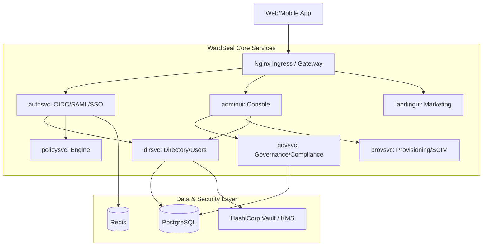

# Architecture Overview

WardSeal is built as a cloud-native, microservices-based identity platform. It is designed for high availability, scalability, and strict tenant isolation.

## System Architecture

The following diagram illustrates the high-level relationship between WardSeal's core services and external components.

## Core Microservices

### 1. Auth Service (`authsvc`)
The heart of the platform. It handles all authentication flows, including OIDC, SAML, and Social Login. It issues JWTs and interacts with `policysvc` to evaluate login-time policies (MFA, IP restrictions).

### 2. Directory Service (`dirsvc`)
Manages the core identity data: users, groups, organizations, and tenants. It ensures strict isolation between different tenants and provides the primary API for identity management.

### 3. Governance Service (`govsvc`)
Handles compliance-heavy logic, including access reviews, campaign management, and organization-level configuration. It bridges the gap between raw identity data and business logic.

### 4. Policy Service (`policysvc`)
The evaluation engine. It takes context (user attributes, device info, location) and returns a "permit" or "deny" decision based on stored rules.

### 5. Provisioning Service (`provsvc`)
Automates the lifecycle of users in external applications. It supports SCIM 2.0 and custom connectors to sync WardSeal identities with downstream systems.

### 6. Admin Console (`adminui`)
The primary UI for IT admins and security teams to manage their WardSeal instance, configure policies, and audit activity.

## Data Consistency and Isolation

- **Tenant Isolation**: Every database record is scoped to a `tenant_id` or `organization_id`.
- **Stateless Services**: All core services are stateless, relying on Redis for session caching and PostgreSQL for persistent state.
- **Security**: Sensitive data (tokens, PII) is encrypted at rest using a KMS provider (e.g., HashiCorp Vault).
